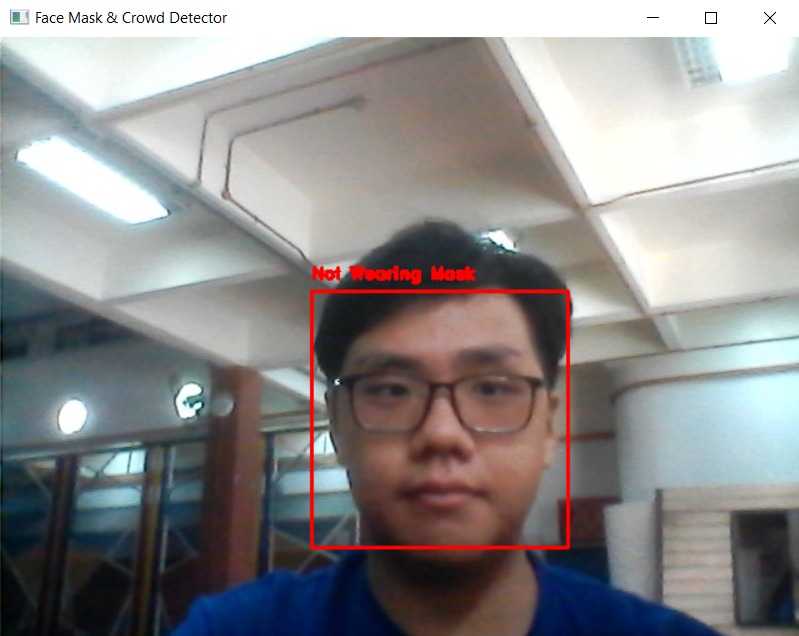
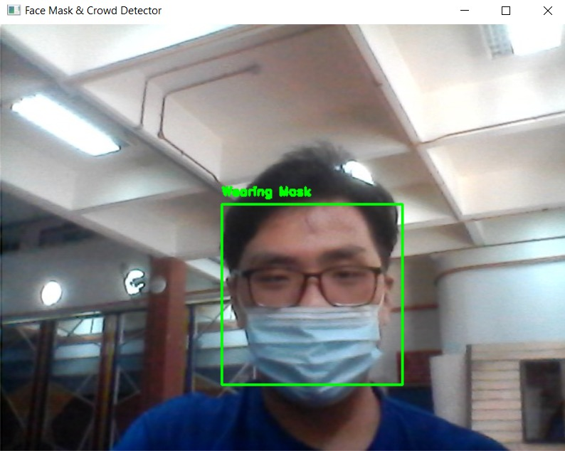
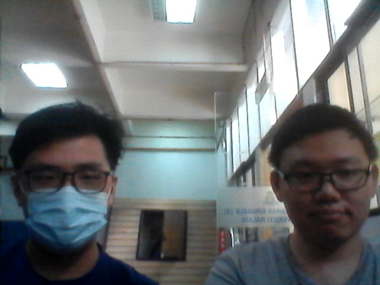
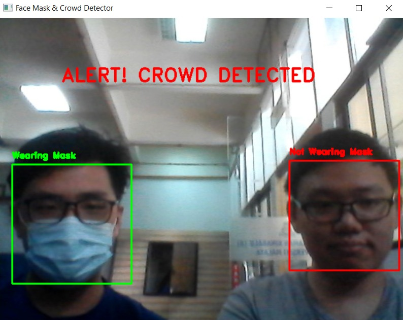

# FaceMaskDetection

## About this Project
This project is an image classification project. It is a project for the course in my university which is WIX3001 Soft Computing

There are 2 objectives for this project which are:
1) To determine whether the person is wearing a mask or not
2) To determine if there's a crowd

## Dataset Source and Reference 
https://github.com/Nikzy7/Covid-Face-Mask-Detector

## How to run
1) Install the packages required by running 

        pip install -r requirements.txt
 
2) Train the model by running 

        python3 train.py
  
3) Classify the images by running 

        python3 predict.py
 
**Notes: In order to change the images to be classified can modify on this part of codes from line 131 to line 136**

      images = [
        cv2.imread("dataset/with_mask/0-with-mask.jpg"), 
        cv2.imread("dataset/without_mask/0.jpg"), 
        cv2.imread("img_one(without mask).jpg"), 
        cv2.imread("img_one(with mask).jpg")
      ]

## Sample Input and Output
### Without Mask and without Crowd

  

  

### With Mask and Without Crowd

  

  

### With and Without Mask With Crowd

  

  

